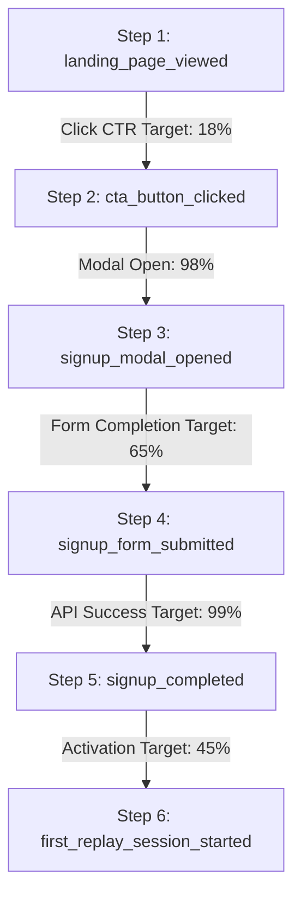

# Deliverable 2: Analytics & Measurement Plan

## 1. Event Taxonomy
We implement an explicit **Object-Action** event taxonomy to avoid the noise and schema drift of generic autocapture.

| Event Name | Trigger | Key Properties | Context / User State |
| :--- | :--- | :--- | :--- |
| `landing_page_viewed` | On page mount | `experiment_id`, `referrer`, `screen_width` | Anonymous session |
| `cta_button_clicked` | User clicks any "Try Free" button | `cta_location` ('hero_primary', 'nav', 'simulator_cta'), `cta_copy` | Anonymous session |
| `signup_modal_opened` | Signup modal renders | `cta_location`, `timestamp` | Anonymous session |
| `signup_form_submitted`| Form submit button clicked | `experience_level`, `primary_market`, `cta_location` | Form submitted |
| `signup_completed` | API returns 201 Created | `user_id`, `primary_market`, `experience_level`, `plan_tier` | Identified User |
| `signup_error_encountered`| Client validation or 400/409 API error | `error_message`, `field` | Incomplete state |
| `backtest_preview_interacted`| User clicks Play, +1 Bar, or timeframe | `action` ('step_forward', 'is_playing', 'timeframe'), `candle_count` | Engagement signal |
| `experiment_variant_exposed`| User assigned to A/B test variant | `experiment_id`, `variant_id` | Experiment cohort |

## 2. Conversion Funnel

* **Funnel Entry:** `landing_page_viewed` (All unique visitors landing on `/`).
* **Intermediate Milestones:** `cta_button_clicked` → `signup_modal_opened` → `signup_form_submitted`.
* **Primary Conversion Event:** `signup_completed` (API returns HTTP 201 and user record is created).
* **Primary Conversion Metric:** **Visitor-to-Account Creation Rate** ($\frac{\text{Unique } \texttt{signup\_completed}}{\text{Unique } \texttt{landing\_page\_viewed}} \times 100$). Target: **12.5%** (industry benchmark for high-intent trading SaaS).

## 3. Tooling Architecture (PostHog + Reverse Proxy)
* **Client SDK:** `posthog-js` configured with `person_profiles: 'identified_only'` to minimize cloud data costs and keep database tables lean.
* **Identity Stitching:** PostHog automatically aliases the anonymous visitor ID (`distinct_id`) to the newly created backend UUID upon calling `analytics.identify(userId, traits)`. All pre-signup marketing touches and UTM campaign parameters remain permanently connected to the user profile.

## 4. Data Quality & Trustworthiness
1. **Adblocker Resiliency:** In trading and finance, ~30% of tech-literate users run uBlock Origin or Brave browser, which silently block standard analytics domains (`google-analytics.com`, `posthog.com`). We route tracking calls through a first-party reverse proxy (`/ingest/*`), guaranteeing full event capture.
2. **Double-Counting Prevention:** Form submissions generate an idempotent client transaction key. Multiple clicks on the submit button are locked out via UI loading states (`isLoading`).
3. **Cross-Subdomain Cookie Synchronization:** The SDK specifies `cross_subdomain_cookie: true` so users transitioning between `fxreplay.com` (marketing) and `app.fxreplay.com` (trading app) do not experience session splits.
