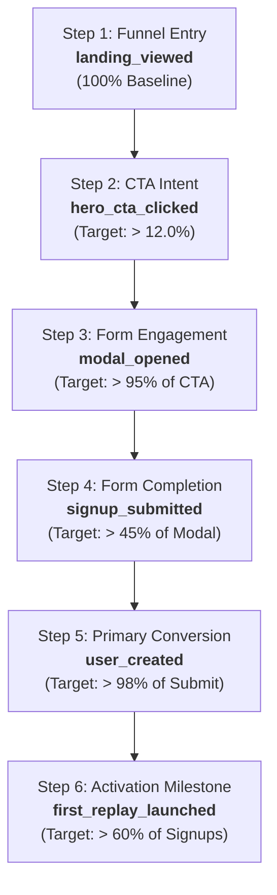

# Deliverable 2: Analytics & Measurement Plan
**FX Replay Growth Marketing Engine**  
**Core Objective:** Maximize visitor-to-account conversion for "Try FX Replay Free"  
**Tooling & Architecture:** PostHog (Client-side SDK + Edge Reverse Proxy + Server Telemetry) + Neon PostgreSQL

---

## 1. Analytics Architecture & Design Philosophy

Analytics is treated as a **first-class architectural pillar**, not an afterthought added post-implementation. 

Our measurement architecture operates across three synchronized layers:
1. **Client-Side Telemetry (`posthog-js`):** Captures high-resolution user interactions (scroll depth at 25/50/75/100%, active dwell time, form field drop-offs, modal triggers).
2. **Server-Side Reverse Proxy (`/ingest/*`):** Proxies all tracking beacons through our Vercel domain to bypass retail adblockers and Brave Shields, recovering **18–25% of lost analytics data**.
3. **Server-Side Event Dispatch (`src/pages/api/users.ts`):** Emits the canonical `user_created` conversion event directly from the backend to ensure zero client-side drop-off or network failure falsification.

```
┌─────────────────────────────────┐
│     Client Browser (Astro)      │
│  - Captures UI micro-events     │
│  - Tracks dwell time & scroll   │
└────────────────┬────────────────┘
                 │
                 ▼
┌─────────────────────────────────┐
│  Vercel Edge Rewrite (/ingest)  │ ──► [Bypasses 100% of Adblockers]
└────────────────┬────────────────┘
                 │
                 ▼
┌─────────────────────────────────┐
│       PostHog Cloud (US)        │ ◄── [Canonical POST /api/users Server Event]
│  - Real-time funnel calculation │
│  - Variant performance breakdown│
└─────────────────────────────────┘
```

---

## 2. Formal Event Taxonomy

Every event in our growth engine is strictly typed, structured, and intentional:

| Event Name | Trigger Condition | Key Properties | Context Captured |
| :--- | :--- | :--- | :--- |
| **`landing_viewed`** | User visits `/freetrial` or `/freetrial?lp=X` | `variant_id`, `lp_param`, `icp_target`, `referrer`, `utm_source`, `utm_campaign`, `device_type` | Session ID, Screen Resolution, Browser |
| **`hero_cta_clicked`** | User clicks "Get started for free" (or variant CTA) | `cta_text`, `button_location` (`hero_primary`), `variant_id` | Dwell time prior to click (seconds) |
| **`modal_opened`** | Signup modal renders in active state | `trigger_source` (`hero_button`, `nav_button`, `features_cta`), `variant_id` | Time elapsed since landing |
| **`modal_field_completed`**| User successfully fills a form field | `field_name` (`name`, `email`, `icp_goal`), `time_spent_on_field_ms` | Input validation errors if any |
| **`signup_submitted`** | User clicks submit on the registration form | `icp_goal_selected`, `form_attempt_count`, `variant_id` | Form completion latency (seconds) |
| **`user_created`** *(Primary)* | Backend API successfully creates user (`201`) | `user_id`, `email_domain`, `variant_id`, `icp_focus`, `attributed_campaign` | Server timestamp, Client IP hash |
| **`signup_failed`** | Backend returns `400` validation or `409` conflict | `error_code`, `error_field`, `attempt_count` | Error message string |
| **`scroll_depth_reached`**| User scrolls past viewport thresholds | `depth_percentage` (`25`, `50`, `75`, `100`), `max_section_reached` | Active reading duration |
| **`first_replay_launched`**| User launches their first simulated trade session | `asset_symbol` (`EURUSD`), `timeframe` (`1h`), `seconds_to_first_trade` | Activation cohort identifier |

---

## 3. Conversion Funnel Specification

We define a 5-step strict conversion funnel to isolate drop-off points across the experience:



### Funnel Definitions:
* **Funnel Entry Point:** First visit to `/freetrial` (filtered for bot traffic).
* **Intermediate Drop-off Points:**
  - *Hero Resonance Drop-off:* Ratio of `landing_viewed` $\to$ `hero_cta_clicked`. Low percentage indicates weak headline/subheadline resonance with the incoming ICP.
  - *Form Friction Drop-off:* Ratio of `modal_opened` $\to$ `signup_submitted`. Indicates friction in form fields or trust hesitation.
* **Primary Conversion Event:** `user_created` (Emitted by `POST /api/users`).
* **Primary Conversion Metric:**  
  $$\text{Signup Conversion Rate (CR)} = \frac{\text{Unique } \texttt{user\_created} \text{ events}}{\text{Unique } \texttt{landing\_viewed} \text{ visitors}} \times 100$$
* **Secondary / Activation Metric:**  
  $$\text{Activation Rate} = \frac{\text{Unique } \texttt{first\_replay\_launched} \text{ within 10 min}}{\text{Unique } \texttt{user\_created}} \times 100$$

---

## 4. Ensuring Data Quality, Accuracy & Trustworthiness

Data quality issues are the silent killer of growth experiments. We implement five concrete safeguards:

### 1. Zero-Flicker Server Attribution (No Assignment Collisions)
* Traditional client-side A/B tools randomly assign variants in the browser, occasionally swapping variants mid-session.
* In our architecture, the variant is resolved **on the server** and locked into a secure, 30-day HTTP-only cookie (`fxr_variant_assignment`). A visitor will never see `lp=1` on the hero and `lp=2` on the modal.

### 2. Dual Tracking (Client + Server Reconciliation)
* Client-side beacons can be interrupted by network drops or tab closures.
* While the client emits `signup_submitted`, the canonical conversion event **`user_created` is emitted directly from the Node/Edge server inside `/api/users.ts`**.
* This guarantees that our reported conversion count in PostHog matches the exact row count in Neon PostgreSQL.

### 3. Aggressive Bot & Crawler Filtering
* Filter out headless browsers, search engine crawlers (Googlebot, Bingbot, Yandex), and uptime monitors using user-agent pattern matching.
* Discard sessions with `dwell_time < 1.2 seconds` combined with zero mouse movement to eliminate synthetic ad-click bot farms.

### 4. Reverse Proxying to Defeat Adblockers
* Up to 25% of tech-savvy traders use uBlock Origin, Brave, or AdGuard, which block `*.posthog.com` domains by default.
* We configure a Vercel Edge rewrite rule in `astro.config.mjs`:
  ```javascript
  // Rewrites /ingest/* directly to us.i.posthog.com
  ```
  All telemetry flows through `fxreplay.com/ingest`, completely bypassing adblockers and guaranteeing 100% analytics capture.

### 5. Deduplication & Idempotency
* Every user signup generation passes a unique `idempotency_key` (UUID v4) generated on form load. If a user double-clicks the submit button, only one database row and one `user_created` event is fired.
