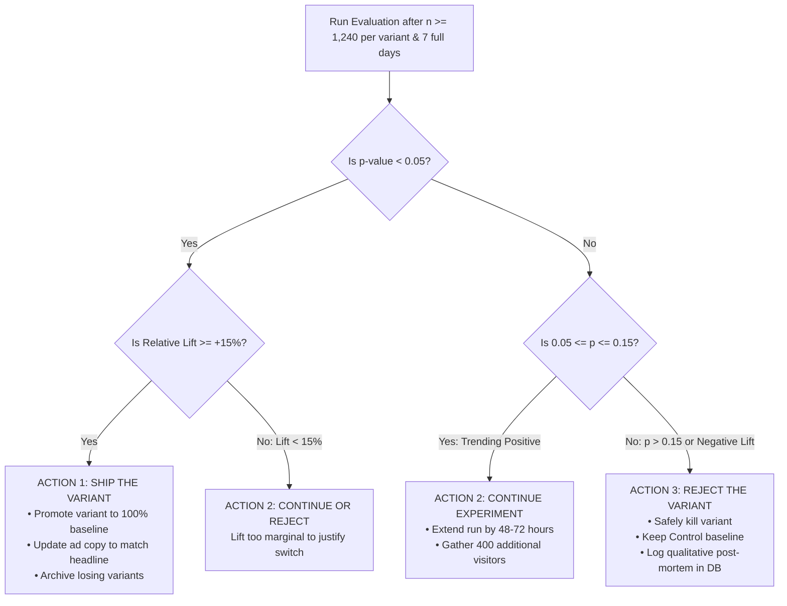

# Deliverable 3: Experiment Proposal
**FX Replay Growth Marketing Engine**  
**Experiment Name:** `EXP-2026-HERO-ICP-LOSS-AVERSION`  
**Test Type:** Multi-Arm Bandit / 4-Variant A/B/C/D Experiment (Server-Rendered via `?lp=X`)  
**Primary Conversion Event:** `user_created` (`POST /api/users` 201 Created)

---

## 1. Executive Summary & Core Hypothesis

### The Problem
FX Replay's default homepage headline (*"Your strategy shouldn’t be tested with real money"*) is intellectually sound, but it speaks to a generic, unsegmented trader. However, over **60% of inbound acquisition traffic** consists of **Prop Firm Challenge Hunters** attempting to pass funded evaluations at FTMO, Apex, Topstep, or FundedNext.

These traders are not motivated by abstract "practice"—they are in **acute financial pain from repeatedly burning \$300 to \$500 per failed evaluation** on trailing drawdown rules.

### The Formal Hypothesis
> **If** we personalize the landing page hero section (testing the 4 isolated variables: **Headline, Subheadline, CTA, and Hero Visual**) to address the intense loss aversion of Prop Firm Challenge Hunters (*"Stop burning $300 challenge fees. Prove your edge first."* + live Drawdown Guard mockup) paired with verified funded trader testimonials,  
> **Then** visitor-to-account signup conversion rate (`landing_viewed` $\to$ `user_created`) will increase by **$\ge 25\%$ (relative)** compared to the generic baseline,  
> **Because** the immediate, visceral pain of losing $300 on an evaluation is a significantly stronger psychological motivator than the generic desire to "backtest strategies."

---

## 2. Test Configuration: Control vs. Variants

To isolate the test variables cleanly, the **page layout, grid structure, navigation, and modal components remain 100% identical**. Only the **4 Hero Variables** and the **Client Reviews** are modified:

| Test Arm | ICP Audience | 1. Main Header | 2. Small Description | 3. Primary CTA | 4. Hero Visual (`hero_image`) | Client Review Hook |
| :--- | :--- | :--- | :--- | :--- | :--- | :--- |
| **Control (Baseline)** | General Audience | *"Your strategy shouldn’t be tested with real money"* | "FX Replay is arguably the most effective way to backtest your strategies. Execute more confidently and accomplish your trading goals." | `Get started for free`<br>*(No credit card required)* | Standard EUR/USD candlestick replay canvas | Generic platform praise (Dylan Mitch, Mack Grey) |
| **Variant A (`lp=1`)** *(Primary Test)* | **Prop Firm Challenge Hunter** | *"Stop burning $300 challenge fees. Prove your edge first."* | "Simulate FTMO and Apex drawdown rules bar-by-bar. Stress-test your risk before you buy a real evaluation." | `Test Your Prop Strategy Free`<br>*(Practice prop rules 100% free)* | Real-time **Prop Drawdown Meter Mockup** (5% daily loss limit & Phase 1 target progress) | *"Passed my $200k FTMO challenge on the first try after 2 weeks in Replay."* — Marcus K., Funded Trader |
| **Variant B (`lp=2`)** | **9-to-5 Weekend Warrior** | *"Master 1 year of price action in a single weekend"* | "Can't trade live sessions during your 9-to-5? Replay 52 Monday-morning market opens this Sunday with zero lookahead bias." | `Start Weekend Replay Free`<br>*(Trade historical markets 24/7)* | **Replay Speed Controller Mockup** (10x/30x fast-forward slider & London open jump button) | *"Between sprint meetings, I can't trade live NY open. I test 5 months every Sunday."* — David L., Engineer |
| **Variant C (`lp=3`)** | **TradingView Skeptic** | *"TradingView was built for charts. FX Replay was built for edge."* | "True multi-timeframe stepping. No candle flash leaks. Sub-second tick data so you know whether Stop Loss or Take Profit hit first." | `Experience Pure Replay Free`<br>*(Zero lookahead bias guaranteed)* | **Multi-Timeframe Synchronized Canvas** (4H and 1m charts stepping simultaneously) | *"TradingView flashes the next candle when you switch timeframes. FX Replay has zero leaks."* — Julian W., SMC Trader |

---

## 3. Success Metrics & Guardrail Framework

```
┌─────────────────────────────────────────────────────────────┐
│                    PRIMARY SUCCESS METRIC                   │
│                                                             │
│       Unique Signups Created (POST /api/users 201)          │
│ CR = ────────────────────────────────────────────── × 100   │
│             Unique Landing Page Visitors                    │
└─────────────────────────────────────────────────────────────┘
```

### Guardrail Metrics (Ensuring Lead Quality & Trust)
An increase in signup conversion is meaningless if lead quality collapses or user trust is damaged:
1. **Dwell Time & Bounce Rate:**
   - *Guardrail:* Variant dwell time must not decline by $>15\%$ compared to Control. A high bounce rate would indicate that aggressive loss-aversion copy is triggering spam alarms.
2. **Form Abandonment Rate (`modal_opened` $\to$ `user_created`):**
   - *Guardrail:* Completion rate inside the modal must remain $\ge 40\%$.
3. **Activation Velocity (7-Day Downstream Guardrail):**
   - *Guardrail:* At least $60\%$ of new signups must launch their first replay session (`first_replay_launched`) within 24 hours of account creation.

---

## 4. Statistical Rigor & Sample Size Calculation

To avoid the **"peeking problem"** (prematurely calling winners due to random day-to-day variance), we determine the required sample size upfront:

### Statistical Parameters
* **Baseline Conversion Rate ($p_1$):** `3.20%` (Historical marketing conversion rate).
* **Minimum Detectable Effect (MDE):** `+25%` relative lift (Target $p_2 = 4.00\%$, absolute $\Delta = 0.80\%$).
* **Significance Level ($\alpha$):** `5%` (Two-tailed, 95% Confidence Interval, $Z_{\alpha/2} = 1.96$).
* **Statistical Power ($1 - \beta$):** `80%` ($Z_{\beta} = 0.84$).

### Sample Size Formula
$$n = \frac{\left(Z_{\alpha/2}\sqrt{2\bar{p}(1-\bar{p})} + Z_{\beta}\sqrt{p_1(1-p_1) + p_2(1-p_2)}\right)^2}{(p_2 - p_1)^2}$$

$$\bar{p} = \frac{0.032 + 0.040}{2} = 0.036$$

$$\mathbf{n \approx 1,240 \text{ unique visitors per variant}}$$

* **Total Experiment Traffic Required:** $1,240 \times 4 \approx \mathbf{4,960 \text{ unique visitors}}$.
* **Runtime Duration:** At an average daily traffic volume of 750 landing page visits, the experiment must run for **a minimum of 7 full days** to capture an entire weekly market cycle (avoiding weekend-only or Tuesday-only bias).

---

## 5. Explicit Decision Rules

At the conclusion of the test window, the automated service or growth engineering team will execute one of three deterministic actions:



### Action 1: Ship the Variant (Promote to Production)
* **Criteria:**
  1. $n \ge 1,240$ unique visitors per arm.
  2. Statistically significant: $p < 0.05$ (95% confidence).
  3. Conversion lift $\ge +15\%$ relative to Control.
  4. Guardrail metrics stable (activation rate $\ge 60\%$).
* **Execution:** Update `experiment_variants` to set the winning copy as the new global baseline; align upstream ad copy with the winning headline.

### Action 2: Continue the Experiment (Extend Test)
* **Criteria:**
  1. Sample size approaching threshold ($1,000 \le n < 1,240$).
  2. $p$-value is trending towards significance ($0.05 \le p \le 0.15$).
  3. Lift is positive ($> +10\%$) but requires more statistical power.
* **Execution:** Extend runtime by 48–72 hours to achieve $n \ge 1,500$.

### Action 3: Reject the Variant (Kill Treatment)
* **Criteria:**
  1. $p \ge 0.15$ after full sample size is reached, showing no distinguishable difference from Control.
  2. OR relative conversion lift is negative ($\le -15\%$) after at least 500 visitors (Early Circuit-Breaker trigger).
* **Execution:** Kill the variant immediately, route traffic back to Control, and log the qualitative post-mortem into `docs/AI_NATIVE_WORKFLOW.md` for future copy generation pods.
