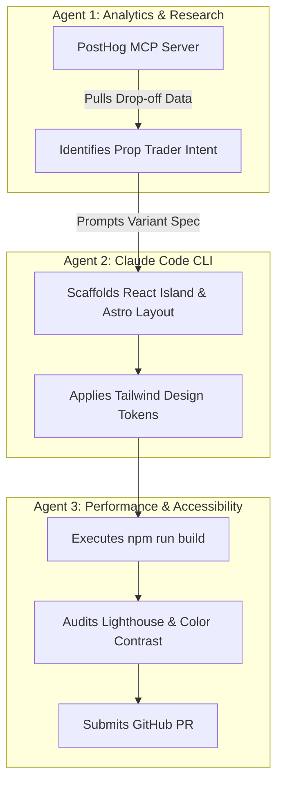

# Deliverable 4: AI-Native Development Workflow

## 1. System Philosophy: AI as Engineering Leverage
At FX Replay, using AI for autocomplete is not enough. This project was built using **Claude Code CLI** as a full autonomous development harness, combined with structured project instructions, custom skills, and an architectural Model Context Protocol (MCP) design.

---

## 2. Project-Level Instructions (`CLAUDE.md`)
The repository includes an active **`CLAUDE.md`** file at the root. It enforces:
* **Framework Boundaries:** Mandatory zero-JS static Astro compilation for marketing sections; React restricted to interactive islands.
* **Design Token Adherence:** Strict usage of FX Replay brand hex codes (`#080A0F`, `#2563EB`, `#00D26A`).
* **Contract Validation:** Requiring all API mutations to pass through Zod schemas in `src/lib/schemas.ts`.
* **Verification Gates:** Enforcing `npm run build` checks before opening PRs.

---

## 3. Reusable Skill / Command (`.claude/commands/cro-experiment.md`)
We committed a specialized Claude Code skill: **`/cro-experiment`**.
* **What it does:** Automates the creation of an A/B test variant inside an Astro/React component.
* **Safety Rules Built-in:** The command forces Claude Code to automatically inject `analytics.track('experiment_variant_exposed')`, check for Cumulative Layout Shift (CLS) regressions, and run TypeScript validation before finishing.

---

## 4. Multi-Agent Team Architecture



### Specialized Responsibilities:
1. **Analytics & Discovery Agent:** Queries historical user behavior via PostHog MCP to surface high-drop-off pages.
2. **Implementation Agent (Claude Code):** Translates conversion hypotheses into typed Astro/React components.
3. **Audit & QA Agent:** Validates semantic markup, runs automated Playwright/Lighthouse checks, and verifies zero layout flicker.

---

## 5. Model Context Protocol (MCP) in Production

In a production FX Replay growth environment, we connect Claude Code to two core MCP servers:

1. **PostHog MCP Server:**
   * *Purpose:* Enables Claude Code to query HogQL analytics and list live feature flags directly from the terminal.
   * *Sample Command:*
     ```bash
     claude "Query PostHog via MCP: what was the 7-day conversion rate for variant_prop_firm vs control on the /try-free page?"
     ```
2. **GitHub MCP Server:**
   * *Purpose:* Allows automated experiment agents to branch, commit variant code, and open a PR with documented Lighthouse performance deltas.

---

## 6. Human Judgment: Where AI Was Corrected & Rejected

True engineering leverage comes from knowing when to override AI. Specific examples from building this project:

### A. Rejected AI Suggestion: Full React Client-Side SPA
* **What the AI proposed:** Initial AI prompts suggested building the entire landing page in React or Next.js with client-side state hooks everywhere.
* **Human Engineering Correction:** I rejected this and enforced Astro’s **Islands Architecture**. Making the features, comparison table, and pricing static HTML removed 300KB+ of unnecessary JavaScript bundle, ensuring a sub-second LCP.

### B. Corrected AI Suggestion: Generic Autocapture Analytics
* **What the AI proposed:** The model initially wrote a generic PostHog snippet with autocapture enabled on all clicks.
* **Human Engineering Correction:** Autocapture generates schema clutter and misses essential growth attributes. I overrode it with an **explicit, typed Object-Action taxonomy** (`src/lib/analytics.ts`) capturing `cta_location`, `experience_level`, and `primary_market`.

### C. Overridden Form Architecture: Unhandled API Edge Cases
* **What the AI proposed:** A simple form that only checked for non-empty strings.
* **Human Engineering Correction:** I implemented full server-side Zod validation, email deduplication (HTTP 409 Conflict), and accessible keyboard traps (Escape key listeners) in `SignupModal.tsx`.
