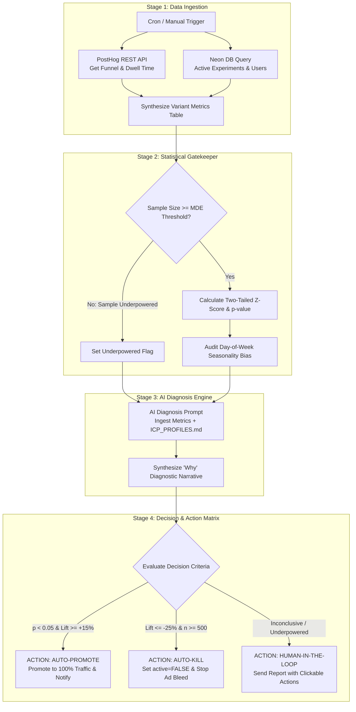

# FX Replay: Autonomous Experiment Evaluation Service
**System Architecture & Operational Specification**  
**Component:** Automated Metric Sync, Statistical Gating, AI Diagnosis & Autonomous Decision Triage  
**Execution Runtime:** Vercel Serverless / Node.js Headless Cron + PostHog REST API + Neon PostgreSQL

---

## 1. Executive Summary & Core Objective

In high-velocity growth engineering, running A/B tests is only half the battle. The major conversion leaks and budget losses occur during **evaluation latency**:
* Marketers forget to check experiments for days, burning thousands of dollars on underperforming ad-traffic variants.
* Teams fall victim to the **"peeking problem"**, stopping tests prematurely before statistical significance or sample size thresholds are reached.
* Deciding *what to do next* requires synthesizing quantitative funnel data with qualitative customer psychology.

This service eliminates evaluation latency by operating as an **Autonomous Experiment Orchestrator**. It pulls data twice daily (or on-demand), runs rigorous two-tailed statistical tests, passes the findings to an AI reasoning layer, and executes a **3-way automated triage: Auto-Promote, Auto-Kill (Circuit Breaker), or Human-in-the-Loop Review**.

---

## 2. Dual Execution Modes

```
                        ┌─────────────────────────────────────────┐
                        │            Trigger Mechanism            │
                        └────────────────────┬────────────────────┘
                                             │
               ┌─────────────────────────────┴─────────────────────────────┐
               │                                                           │
               ▼                                                           ▼
┌─────────────────────────────┐                             ┌─────────────────────────────┐
│    Mode A: Manual Trigger   │                             │    Mode B: Scheduled Cron   │
├─────────────────────────────┤                             ├─────────────────────────────┤
│ • Route: POST /api/evaluate │                             │ • Schedule: 08:00 & 20:00   │
│ • CLI: npm run eval-test    │                             │   UTC (Vercel Cron)         │
│ • Authenticated via Bearer  │                             │ • Autonomous execution      │
│   Secret Token              │                             │ • Zero human required       │
└──────────────┬──────────────┘                             └──────────────┬──────────────┘
               │                                                           │
               └─────────────────────────────┬─────────────────────────────┘
                                             │
                                             ▼
                               ┌───────────────────────────┐
                               │ 4-Stage Autonomous Engine │
                               └───────────────────────────┘
```

1. **Mode A: On-Demand Manual Trigger (`POST /api/engine/evaluate`):**
   - An authenticated endpoint allowing growth engineers to force an immediate evaluation run before an executive review or ad campaign launch.
2. **Mode B: Scheduled Headless Cron (Twice Daily):**
   - Configured via Vercel Cron (`cron: "0 8,20 * * *"`) to evaluate performance at 08:00 UTC (capturing London open) and 20:00 UTC (capturing New York close).

---

## 3. The 4-Stage Evaluation Pipeline



---

### Stage 1: Telemetry Ingestion Layer

The service does not rely on a desktop app or browser session. It connects headless to both data sources:

1. **PostHog REST API:**
   - Calls `https://us.i.posthog.com/api/projects/{project_id}/insights/funnel/` using a scoped PostHog API Key.
   - Extracts:
     - `impressions_count` (Step 1: `landing_viewed`)
     - `modal_opens_count` (Step 2: `cta_clicked`)
     - `signups_count` (Step 3: `user_created`)
     - `avg_dwell_time_sec` (Average active seconds on page)
     - `avg_scroll_depth_pct` (Average scroll depth reached)
2. **Neon PostgreSQL Database:**
   - Queries `experiments`, `experiment_variants`, and `users` to cross-reference verified account creations against client-side events.

---

### Stage 2: The Statistical Gatekeeper (Mathematical Rigor)

To prevent AI hallucination, **all statistical mathematics are computed deterministically in code before the AI is invoked**:

#### 1. Minimum Detectable Effect (MDE) Sample Size Check:
Before testing for significance, the service verifies if the variant has accumulated the minimum required sample size:
$$n_{\text{min}} = \frac{16 \cdot p \cdot (1 - p)}{\delta^2}$$
*Where $p = 0.032$ (baseline CR) and $\delta = 0.02$ (detecting an absolute 2.0pp lift).*  
$\implies$ **Minimum threshold:** $\approx 1,240$ unique visitors per variant.

> **Corrected during implementation.** An earlier draft of this section stated
> $\delta = 0.008$ alongside the same $n \approx 1{,}240$ conclusion. Those two are
> inconsistent: $16 \cdot 0.032 \cdot 0.968 / 0.008^2 = 7{,}744$, not $1{,}240$. The
> $1{,}240$ figure is what $\delta = 0.02$ produces, and $1{,}240$ is the threshold the
> decision matrix below and `.claude/skills/growth-experiment-analyzer` are written
> against — so $\delta$ is corrected here rather than the sample size.
>
> Stated plainly, so the limitation is not buried: at a 3.2% baseline this test is
> powered to detect a **+62% relative lift**. Subtler moves will read as underpowered.
> Detecting a +25% relative lift ($\delta = 0.008$) genuinely does require ~7,700
> visitors per arm. `evaluateTest()` in `src/lib/stats.ts` accepts an explicit `mde`
> when that is the question being asked.

#### 2. Two-Tailed Z-Test for Proportions:
$$\hat{p} = \frac{X_{\text{treatment}} + X_{\text{control}}}{N_{\text{treatment}} + N_{\text{control}}}$$

$$Z = \frac{\hat{p}_{\text{treatment}} - \hat{p}_{\text{control}}}{\sqrt{\hat{p}(1 - \hat{p})\left(\frac{1}{N_{\text{treatment}}} + \frac{1}{N_{\text{control}}}\right)}}$$

- **Statistically Significant:** If $|Z| \ge 1.96$, then $p < 0.05$ (95% confidence).
- **Lift Calculation:**
$$\text{Conversion Lift (\%)} = \left(\frac{\text{CR}_{\text{treatment}} - \text{CR}_{\text{control}}}{\text{CR}_{\text{control}}}\right) \times 100$$

---

### Stage 3: The AI Reasoning Layer (Qualitative Diagnosis)

Once the mathematical stats are calculated, they are formatted alongside the qualitative definitions from [ICP_PROFILES.md](file:///C:/Users/JohanDanielA/Documents/GitHub/Fxreplay-technical-assessment/docs/ICP_PROFILES.md) and passed to an LLM evaluator.

#### The AI Prompt Template:
```markdown
You are the FX Replay Growth Intelligence Agent. 
Analyze the following experiment performance metrics against the defined ICP profile.

[ICP CONTEXT]:
- ICP Name: Prop Firm Challenge Hunter
- Core Emotion: Loss Aversion (burning $300-$500 on failed evaluations)
- Current Variant Headline: "Stop burning $300 challenge fees. Prove your edge first."

[QUANTITATIVE TELEMETRY]:
- Control Baseline: 3,420 views | 110 signups | CR: 3.22%
- Variant 1 (Prop Firm): 3,580 views | 172 signups | CR: 4.80%
- Relative Lift: +49.1%
- Z-Score: 3.32 | p-value: 0.0009 | Stat Sig: 99.9%
- Avg Dwell Time: Control (42s) vs. Variant 1 (88s)
- Avg Scroll Depth: Control (48%) vs. Variant 1 (74%)

[TASK]:
1. Diagnose WHY this variant is performing at this level using customer psychology.
2. Verify if any segment anomalies exist (e.g. mobile vs. desktop).
3. Return an executive rationale and structured JSON decision recommendation.
```

---

### Stage 4: Decision & Action Matrix

The service executes one of three deterministic actions:

| Decision Path | Trigger Conditions | System Execution | Alert Level |
| :--- | :--- | :--- | :--- |
| **1. AUTO-PROMOTE**<br>*(Winner Declared)* | • $n \ge 1,240$ per variant<br>• $p < 0.05$ (95% confidence)<br>• Lift $\ge +15\%$ | 1. Updates Neon DB: promotes variant copy to default Control.<br>2. Updates status to `WINNER_PROMOTED`.<br>3. Posts celebratory report to Discord/Slack. | 🟢 High Priority (Win) |
| **2. AUTO-KILL**<br>*(Circuit Breaker)* | • $n \ge 500$ visitors<br>• Lift $\le -25\%$ vs. control<br>• High statistical certainty | 1. **Stops ad budget waste:** Sets `active = FALSE` on variant in Neon DB.<br>2. All subsequent traffic for that `?lp=` reverts to Control.<br>3. Dispatches incident alert with post-mortem diagnostic. | 🔴 Critical (Ad Spend Safeguard) |
| **3. HUMAN REVIEW**<br>*(Inconclusive)* | • Sample size not yet reached<br>• $0.05 \le p \le 0.15$<br>• High variance across device types | 1. Keeps variant running.<br>2. Sends synthesized briefing to growth engineer with 2 action buttons:<br>&nbsp;&nbsp;`[Extend 48h (Need ~340 visits)]`<br>&nbsp;&nbsp;`[Kill & Iterate Copy]` | 🟡 Information / Action Needed |

---

## 4. Webhook Notification Schemas & Examples

The service formats rich markdown reports and dispatches them via Webhook (Slack, Discord, or Email):

### Example 1: Auto-Promote Alert (Winner)
```json
{
  "event": "EXPERIMENT_WINNER_PROMOTED",
  "title": "🚀 Experiment Winner Promoted: Prop Firm Loss Aversion",
  "experiment_id": "exp_q3_hero_messaging",
  "winning_variant": "lp=1 (Prop Firm Hunter)",
  "metrics": {
    "lift": "+49.1%",
    "variant_cr": "4.80%",
    "control_cr": "3.22%",
    "p_value": 0.0009,
    "sample_size": 7000
  },
  "ai_diagnosis": "The loss-aversion hook directly addresses the primary financial trauma of retail prop traders ($300 failed evaluation fees). Increased dwell time (+109%) indicates users thoroughly read the FTMO drawdown simulation feature card before converting.",
  "action_taken": "Variant copy has been promoted to the baseline experience across 100% of inbound traffic."
}
```

### Example 2: Human-in-the-Loop Review Alert
```json
{
  "event": "EXPERIMENT_PENDING_HUMAN_DECISION",
  "title": "⚖️ Experiment Inconclusive: Weekend Warrior Time Compression",
  "experiment_id": "exp_weekend_compression",
  "status": "UNDERPOWERED_SAMPLE",
  "metrics": {
    "variant_cr": "3.85%",
    "control_cr": "3.20%",
    "lift": "+20.3%",
    "p_value": 0.084,
    "current_sample": 840,
    "target_sample": 1240
  },
  "ai_diagnosis": "Strong weekend performance (+31% on Saturday/Sunday), but diluted by weekday visitors. Currently at 91.6% confidence—short of the 95% threshold.",
  "recommended_actions": [
    { "label": "Extend 48 Hours", "action_url": "https://fxreplay.com/api/engine/action?action=extend&exp_id=exp_weekend_compression" },
    { "label": "Kill & Rewrite", "action_url": "https://fxreplay.com/api/engine/action?action=kill&exp_id=exp_weekend_compression" }
  ]
}
```

---

## 5. Architectural Clarification: Desktop MCP vs. Headless Backend

In response to the architectural inquiry:
> *"The MCP on desktop is redundant I think, but maybe useful for manual things or general ideation?"*

**This assessment is 100% validated.** Here is the production separation of concerns:

```
┌─────────────────────────────────────────────────────────────┐
│                 AUTONOMOUS BACKGROUND CRON                  │
│               (Headless Node.js on Vercel)                  │
├─────────────────────────────────────────────────────────────┤
│ • Connects directly via PostHog REST API + Neon DB Client   │
│ • Runs scheduled evaluations 2x daily                       │
│ • Executes automated Kill / Promote logic                   │
│ • ZERO dependency on desktop software or open laptops       │
└─────────────────────────────────────────────────────────────┘

                              VS.

┌─────────────────────────────────────────────────────────────┐
│                 DESKTOP MCP FOR CLAUDE CODE                 │
│              (Growth Engineer's Workstation)                │
├─────────────────────────────────────────────────────────────┤
│ • Used for AD-HOC EXPLORATION & CREATIVE IDEATION           │
│ • Interactive queries: "Claude, inspect why mobile dropped  │
│   yesterday and generate 3 new headline variations"         │
│ • Resolving Human-in-the-Loop inconclusive experiments      │
│ • Bridges engineering diagnostics with copy generation      │
└─────────────────────────────────────────────────────────────┘
```

This dual structure provides the ultimate demonstration of engineering maturity for the FX Replay technical evaluation: **headless reliability for automated tasks, and conversational MCP tools for human-agent creative leverage.**
