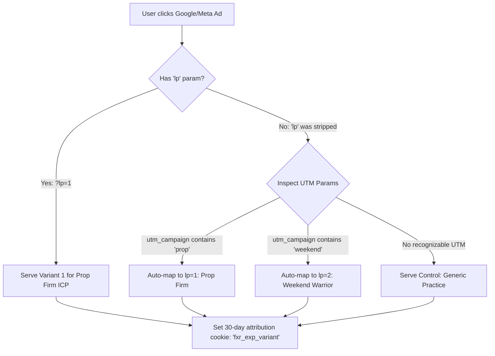

# FX Replay Growth Marketing Engine: Architecture & Planning Document
**Focus:** Server-Side Pre-Rendered Experiments, ICP Personalization & Internal Growth Dashboard  
**Status:** Approved Architectural Plan  
**Target Environment:** Vercel (Astro 5 SSR via @astrojs/vercel, React 19 Islands)

---

## 1. Executive Summary & Core Hypothesis

### The Growth Challenge
FX Replay's growth objective is to maximize visitor-to-account conversion for the **"Try FX Replay Free"** offer. Traffic originates from diverse acquisition channels (Google Search Ads, Meta Video Ads, YouTube Influencers, Organic SEO) with wildly differing search intents and psychological motivations.

### The Strategic Decision: Single Design Template, Variable Copy & Messaging
To run statistically valid and clean experiments, **the landing page design, layout, and visual structure must remain constant**. 
- **Isolated Variable:** Copy, messaging, value propositions, and social proof.
- **Controlled Variable:** Page layout, typography, UI components, interactive conversion modal.
- **Why this matters:** When a variant wins, we know with mathematical certainty that the *messaging resonated with the ICP*, rather than the win being an artifact of an altered button layout or visual distraction.

---

## 2. Route Architecture & Pre-Rendering Strategy

```
                             [Traffic Inflow]
                   (Google Ads / Meta Ads / Direct / SEO)
                                     │
                                     ▼
                    ┌─────────────────────────────────┐
                    │     https://fxreplay.com        │
                    └────────────────┬────────────────┘
                                     │
         ┌───────────────────────────┴───────────────────────────┐
         │                                                       │
         ▼                                                       ▼
┌─────────────────────────────────┐             ┌─────────────────────────────────┐
│     /freetrial?lp=[id]          │             │        /marketingengine         │
│  (Public Experiment Target)     │             │  (Internal Growth & ICP Hub)    │
├─────────────────────────────────┤             ├─────────────────────────────────┤
│ • Server-side pre-rendered (SSR)│             │ • ICP Profile Directory         │
│ • Zero Cumulative Layout Shift  │             │ • Active & Completed Experiments│
│ • Deterministic ICP Copy Match  │             │ • Variant Comparison & Copy Diff│
│ • Scroll Depth & Dwell Telemetry│             │ • Live Conversion Funnel Stats  │
└─────────────────────────────────┘             └─────────────────────────────────┘
```

### Route 1: `/freetrial` (Experiment Delivery Surface)
- **Primary URL:** `fxreplay.com/freetrial` (Serves the default Control baseline).
- **Targeted URL:** `fxreplay.com/freetrial?lp=1` (or `?lp=prop-firm`, `?lp=weekend-trader`).
- **Server-Side Pre-Rendering (Zero CLS):**
  - Astro Server Engine extracts searchParams (Astro.url.searchParams) on the server request.
  - The variant copy dictionary is resolved from the database/repository **before HTML serialization**.
  - The rendered HTML arrives at the user's browser with the exact ICP headlines and copy already in place.
  - **Result:** Cumulative Layout Shift (**CLS = 0.00**), Instant First Contentful Paint (**FCP < 0.6s**), and no visual "flicker" or content swapping.

### Route 2: `/marketingengine` (Internal Experimentation & Analytics OS)
- **Target Audience:** Internal Growth Engineers, Performance Marketers, and Product Managers.
- **Core Capabilities:**
  1. **ICP Central Library:** Manage defined personas, their emotional triggers, target keywords, and ad angles.
  2. **Experiments Overview Table:** Real-time visibility into all running, paused, and concluded tests.
  3. **Experiment Detail & Variation Inspector:** Side-by-side copy comparison, scroll depth curves, avg time on page, and statistical significance calculations.

---

## 3. Data Storage & Schema Design

To host seamlessly on Vercel while enabling real-time analytics and persistence, we define a relational schema (compatible with Vercel Postgres / Neon / SQLite / In-Memory Repository with persistence seeds):

```
┌─────────────────┐       1:N       ┌─────────────────────┐       1:N       ┌─────────────────────┐
│      icps       │ ─────────────── │     experiments     │ ─────────────── │  experiment_variants│
├─────────────────┤                 ├─────────────────────┤                 ├─────────────────────┤
│ id (PK)         │                 │ id (PK)             │                 │ id (PK)             │
│ slug            │                 │ icp_id (FK)         │                 │ experiment_id (FK)  │
│ name            │                 │ name                │                 │ lp_param (e.g. '1') │
│ target_keywords │                 │ status              │                 │ is_control (bool)   │
│ core_pains      │                 │ baseline_cr         │                 │ copy_payload (JSON) │
│ core_desires    │                 │ expected_cr         │                 │ views_count         │
│ created_at      │                 │ created_at          │                 │ conversions_count   │
└─────────────────┘                 └─────────────────────┘                 └──────────┬──────────┘
                                                                                       │ 1:N
                                                                                       ▼
                                                                            ┌─────────────────────┐
                                                                            │   session_metrics   │
                                                                            ├─────────────────────┤
                                                                            │ id (PK)             │
                                                                            │ variant_id (FK)     │
                                                                            │ session_id          │
                                                                            │ scroll_depth_pct    │
                                                                            │ time_on_page_sec    │
                                                                            │ converted (bool)    │
                                                                            │ created_at          │
                                                                            └─────────────────────┘
```

### Table Definitions & JSON Contracts

#### 1. `icps` (Ideal Customer Profiles)
```json
{
  "id": "icp_prop_hunter",
  "slug": "prop-firm-hunter",
  "name": "Prop Firm Challenge Hunter",
  "target_keywords": [
    "pass ftmo challenge",
    "prop firm simulator",
    "best backtesting for forex prop firms",
    "apex daily drawdown practice"
  ],
  "core_pains": [
    "Bleeding $300-$500 per failed evaluation",
    "Failing on the 5% max daily drawdown rule",
    "Emotional anxiety and imposter syndrome"
  ],
  "core_desires": [
    "Get funded for $100k-$200k",
    "Receive consistent 80/20 profit splits",
    "Verify mathematical edge before paying challenge fees"
  ]
}
```

#### 2. `experiments` (Experiment Registry)
```json
{
  "id": "exp_q3_hero_messaging",
  "icp_id": "icp_prop_hunter",
  "name": "Hero Loss Aversion vs. Generic Practice",
  "status": "RUNNING",
  "baseline_cr": 3.2,
  "expected_cr": 4.5,
  "created_at": "2026-09-17T00:00:00Z"
}
```

#### 3. `experiment_variants` (The Copy Payload)
```json
{
  "id": "var_prop_hunter_lp1",
  "experiment_id": "exp_q3_hero_messaging",
  "lp_param": "1",
  "is_control": false,
  "copy_payload": {
    "eyebrow": "PROP FIRM CHALLENGE ACCELERATOR",
    "hero_headline": "Stop burning $300 challenge fees. Prove your edge first.",
    "subheadline": "Simulate strict FTMO, Apex, and Topstep drawdown rules bar-by-bar. Discover your statistical expectancy before you buy an evaluation.",
    "primary_cta": "Test Your Prop Strategy Free",
    "cta_microcopy": "No credit card required. Practice prop rules 100% free.",
    "pillar_1_title": "Built-in Prop Rules Engine",
    "pillar_1_desc": "Live tracking of max daily loss, overall drawdown, and profit targets in real time.",
    "pillar_2_title": "Fail in Replay, Not on Evaluation",
    "pillar_2_desc": "Save thousands of dollars in evaluation resets by stress-testing your strategy first.",
    "pillar_3_title": "Payout-Ready Analytics",
    "pillar_3_desc": "Export verified trade logs and equity curves that prove your consistency."
  }
}
```

#### 4. `session_metrics` (Aggregated Telemetry per Visitor)
* `variant_id`: References the served variant (`lp_param`).
* `session_id`: Unique anonymous session ID.
* `scroll_depth_pct`: Furthest point reached (`25`, `50`, `75`, `100`).
* `time_on_page_sec`: Active dwell time before exit or conversion.
* `converted`: Boolean (`true` if user completed the `/api/users` signup flow).

---

## 4. Ad-Tracking, Attribution & Fallback Architecture

### Handling Ad-Tracker Stripping & UTM Forwarding
Modern privacy browsers and ad-click aggregators (Google Parallel Tracking, Meta Click IDs, Apple Private Relay) occasionally strip non-standard query parameters like `?lp=1`.



### Attribution Resilience Rules:
1. **Direct Parameter Priority:** If `?lp=1` is present, it directly overrides all logic and binds the session to Variant 1.
2. **Campaign Heuristic Fallback:** If `?lp=` is absent, the server reads `utm_campaign`, `utm_term`, or `utm_content`. Keywords like `ftmo`, `prop`, `evaluation` automatically resolve to `lp=1`.
3. **Cookie Persistence:** Once assigned, the variant ID is written to an HTTP-only session cookie (`fxr_variant_assignment`). If the user reloads or navigates across sub-pages, they experience 100% copy consistency.

---

## 5. The `/marketingengine` Internal Dashboard Specification

The internal dashboard is built with 3 primary management views:

### View 1: ICP Command Center
A visual directory of all target customer profiles:
- **Card 1: Prop Firm Challenge Hunter (60% Traffic Share)**
  - *Primary Ad Angles:* Loss aversion, avoiding reset fees, passing Phase 1/2.
  - *Active Mapped Landing Page:* `fxreplay.com/freetrial?lp=1`
- **Card 2: 9-to-5 Weekend Warrior (30% Traffic Share)**
  - *Primary Ad Angles:* Time compression, trading 1 year of data on a Sunday, busy schedule.
  - *Active Mapped Landing Page:* `fxreplay.com/freetrial?lp=2`
- **Card 3: TradingView Skeptic / Precision Scalper (10% Traffic Share)**
  - *Primary Ad Angles:* No lookahead bias, sub-second tick data, TradingView replay flaws.
  - *Active Mapped Landing Page:* `fxreplay.com/freetrial?lp=3`

---

### View 2: Experiments Registry Table
A clean, real-time table showing experiment velocity:

| Experiment Name | Start Date | Target ICP | Total Views | Total Signups | Current CR | Baseline CR | Lift vs Baseline | Stat Sig | Status | Actions |
| :--- | :--- | :--- | :--- | :--- | :--- | :--- | :--- | :--- | :--- | :--- |
| **Hero Loss Aversion** | Sep 12, 2026 | Prop Firm Hunter | 14,280 | 685 | **4.80%** | 3.20% | **+50.0%** | **98.4% (Winner)** | `Active` | [Inspect] [Promote] |
| **Weekend Time Compression** | Sep 14, 2026 | Weekend Warrior | 8,940 | 384 | **4.29%** | 3.20% | **+34.1%** | **95.2% (Winner)** | `Active` | [Inspect] [Promote] |
| **Sub-Second Tick Accuracy** | Sep 15, 2026 | TV Skeptic | 2,150 | 73 | **3.40%** | 3.20% | **+6.2%** | *68.1% (Low)* | `Running` | [Inspect] [Pause] |

---

### View 3: Experiment Deep-Dive & Analytics Inspector (Detail Screen)
Clicking into an experiment reveals:
1. **Side-by-Side Copy Diff:**
   - Visual side-by-side comparison of the Control copy vs. Variant copy (Headline, Subhead, CTA, Pillars).
2. **Behavioral Engagement Metrics:**
   - **Average Time Spent on Page:** Control (48s) vs. Variant A (1m 24s) $\to$ *Indicates deeper resonance*.
   - **Scroll Depth Waterfall:**
     - 25% (Hero): 94% retention
     - 50% (TradingView Comparison): 76% retention
     - 75% (Prop Simulator Features): 58% retention
     - 100% (Pricing / Bottom CTA): 41% retention
3. **Conversion Funnel Breakdown:**
   - Page Impressions $\to$ Modal Clicks $\to$ Form Inputs Completed $\to$ Account Created (`/api/users` 201 Created).

---

## 6. Implementation Milestones

```
Phase 1: Architecture & Data Modeling (Completed)
 └── Single-template strategy defined
 └── Data schemas for ICPs, Experiments, Variants, and Telemetry designed
 └── Zero-CLS server-side pre-rendering plan established

Phase 2: Copywriting & ICP Asset Generation (Current Step)
 └── Refine copy dictionaries for lp=1 (Prop Firm), lp=2 (Weekend), lp=3 (TradingView)
 └── Ensure high emotional urgency without triggering anti-spam/trust alarms

Phase 3: Dashboard & Experiment Pipeline Structure
 └── Design the schema representation for the /marketingengine dashboard
 └── Formalize the A/B testing statistical decision criteria (Sample Size, MDE, p < 0.05)
```
